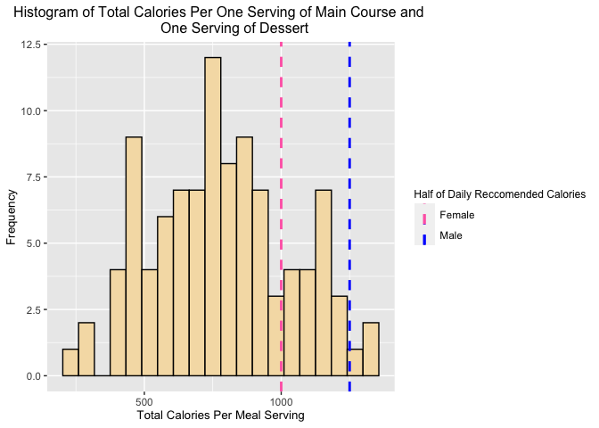

Interacting with APIs: Food Analysis
================
Simon Weisenhorn
2023-06-25

- <a href="#requirements" id="toc-requirements">Requirements</a>
- <a href="#api-interaction-functions"
  id="toc-api-interaction-functions">API Interaction Functions</a>
  - <a href="#recipesbycuisine"
    id="toc-recipesbycuisine"><code>recipesByCuisine</code></a>
  - <a href="#recipesbydiet"
    id="toc-recipesbydiet"><code>recipesByDiet</code></a>
  - <a href="#recipesbyintolerances"
    id="toc-recipesbyintolerances"><code>recipesByIntolerances</code></a>
  - <a href="#recipesbytype"
    id="toc-recipesbytype"><code>recipesByType</code></a>
  - <a href="#taste" id="toc-taste"><code>taste</code></a>
  - <a href="#multipletastes"
    id="toc-multipletastes"><code>multipleTastes</code></a>
  - <a href="#getnutrientsperserving"
    id="toc-getnutrientsperserving"><code>getNutrientsPerServing</code></a>
  - <a href="#multiplenutrients"
    id="toc-multiplenutrients"><code>multipleNutrients</code></a>
  - <a href="#multiplenutrients-1"
    id="toc-multiplenutrients-1"><code>multipleNutrients</code></a>
  - <a href="#equipment" id="toc-equipment"><code>equipment</code></a>
  - <a href="#recipeinstructions"
    id="toc-recipeinstructions"><code>recipeInstructions</code></a>
  - <a href="#foodapi" id="toc-foodapi"><code>foodAPI</code></a>
- <a href="#data-exploration" id="toc-data-exploration">Data
  Exploration</a>
- <a href="#wrap-up" id="toc-wrap-up">Wrap up</a>

This is a vignette designed to show how to interact with an
[API](https://en.wikipedia.org/wiki/API) and study the relationships of
different food recipes. The data comes directly from [spoonacular
API](https://spoonacular.com/food-api/docs) through the use of several
functions that will be explored below. Following the functions, I have
also explored many graphs and relationships with the given data. Enjoy!

# Requirements

To use the functions that I created, you must load each of the following
functions using the library function in your R console. The functions
are as follows:

- `httr`: This library is used for interacting with the API and querying
  results  
- `jsonlite`: This library is used for parsing through the queried
  results  
- `tidyverse`: This library is used for all of the data cleaning and
  visualizations  
- `stringr`: This library is used solely for the `str_to_title()`
  function

# API Interaction Functions

Here is where I define all of the functions that interact with the
[spoonacular API](https://spoonacular.com/food-api/docs). There are also
a handful of helper functions.

## `recipesByCuisine`

This function is used to query recipes based on the user’s liked
cuisines. There are optional arguments to supply disliked cuisines and
the number of outputted recipes between 0 and 100. The user may also
supply as many liked cuisines and disliked cuisines as they would like.
The function returns a `data.frame` of the title and ID of the recipe.

``` r
recipesByCuisine <- function(likedCuisine, dislikedCuisine=NULL, number=10) {
  
  if((number > 100) | (number <= 0)){
    stop("ERROR: Argument for number must be between 0 and 100!")
  }
  
  likedCuisine <- tolower(likedCuisine)
  dislikedCuisine <- tolower(dislikedCuisine)
  likedCuisine <- paste(likedCuisine, collapse=',')
  dislikedCuisine <- paste(dislikedCuisine, collapse=',')
  if(length(dislikedCuisine)>0){
  recipes <- GET(
    paste("https://api.spoonacular.com/recipes/complexSearch?cuisine=",
                       likedCuisine,"&excludeCuisine=",dislikedCuisine,
                       "&number=",number,
                       "&apiKey=f8ceed6cf4f74d56b1584d84ee70ec9b", sep=""))
  } else {
  recipes <- GET(
    paste("https://api.spoonacular.com/recipes/complexSearch?cuisine=",
                         likedCuisine,"&number=",number,
                         "&apiKey=f8ceed6cf4f74d56b1584d84ee70ec9b", sep=""))
  }
  parsed <- fromJSON(rawToChar(recipes$content))
  recipeInfo <- parsed$results 
  data <- as_tibble(recipeInfo[,c("id", "title")])
  data <- data %>% rename(ID = id, Recipe = title)
  return(data)
}
```

## `recipesByDiet`

Similar to `recipesByCuisine`, this function is used to query recipes
based on the user’s specified diet plan, such as Vegan or Ketogenic.
There are optional arguments to supply the number of outputted recipes
between 0 and 100. The function returns a `data.frame` of the title and
ID of the recipe.

``` r
recipesByDiet <- function(diet, number=10) {
  
  if((number > 100) | (number <= 0)){
    stop("ERROR: Argument for number must be between 0 and 100!")
  }
  
  diet <- tolower(diet)
  diet <- paste(diet, collapse=',')
  recipes <- GET(
    paste("https://api.spoonacular.com/recipes/complexSearch?diet=",
                       diet,"&number=",number,
                       "&apiKey=f8ceed6cf4f74d56b1584d84ee70ec9b", sep=""))
  parsed <- fromJSON(rawToChar(recipes$content))
  recipeInfo <- parsed$results 
  data <- as_tibble(recipeInfo[,c("id", "title")])
  data <- data %>% rename(ID = id, Recipe = title)
  return(data)
}
```

## `recipesByIntolerances`

Similar to `recipesByCuisine` and `recipesByDiet`, this function is used
to query recipes based on the user’s specified food intolerances or
allergies. There are optional arguments to supply the number of
outputted recipes between 0 and 100. The function returns a `data.frame`
of the title and ID of the recipe.

``` r
recipesByIntolerances <- function(intolerance, number=10) {
  
  if((number > 100) | (number <= 0)){
    stop("ERROR: Argument for number must be between 0 and 100!")
  }
  
  intolerance <- tolower(intolerance)
  intolerance <- paste(intolerance, collapse=',')
  recipes <- GET(
    paste("https://api.spoonacular.com/recipes/complexSearch?intolerances=",
          intolerance,"&number=",number,
          "&apiKey=f8ceed6cf4f74d56b1584d84ee70ec9b", sep=""))
  parsed <- fromJSON(rawToChar(recipes$content))
  recipeInfo <- parsed$results 
  data <- as_tibble(recipeInfo[,c("id", "title")])
  data <- data %>% rename(ID = id, Recipe = title)
  return(data)
}
```

## `recipesByType`

Similar to the previous three functions, this function is used to query
recipes based on the user’s specified meal course, such as the main
course or dessert. There are optional arguments to supply the number of
outputted recipes between 0 and 100. The function returns a `data.frame`
of the title and ID of the recipe.

``` r
recipesByType = function(type, number=10) {
  
  if((number > 100) | (number <= 0)){
    stop("ERROR: Argument for number must be between 0 and 100!")
  }
  
  type = tolower(type)
  type = paste(type, collapse=',')
  type = sub(" ", "_", type)
  recipes <- GET(
    paste("https://api.spoonacular.com/recipes/complexSearch?type=",type,
          "&number=",number,"&apiKey=f8ceed6cf4f74d56b1584d84ee70ec9b", sep=""))
  parsed <- fromJSON(rawToChar(recipes$content))
  recipeInfo <- parsed$results 
  data = as_tibble(recipeInfo[,c("id", "title")])
  data = data %>% rename(ID = id, Recipe = title)
  return(data)
}
```

## `taste`

Once the user decides on a recipe through using one or more of the
functions above, they can take the ID of the recipe and enter it into
this function to get a detailed list on the level of each of the
following tastes: `sweetness`, `saltiness`, `sourness`, `bitterness`,
`savoriness`, `fattiness`, and `spiciness`. These flavors are listed on
a scale from 0 to 100 with the `spiciness` level being on the Scoville
scale. This function should help the user decide how the dish will
taste.

``` r
taste <- function(id, type=NULL) {
  tastes <- GET(
    paste("https://api.spoonacular.com/recipes/",id,
          "/tasteWidget.json?apiKey=f8ceed6cf4f74d56b1584d84ee70ec9b", 
          sep=""))
  parsed <- fromJSON(rawToChar(tastes$content))
  data <- data.frame(parsed)
  data <- data %>% mutate(ID=id) %>% select(ID, everything())
  if (length(type)>0){
    type <- unlist(lapply(type, tolower))
    return(data[c("ID", type)])
  } else{
    return(data)
  }
}
```

## `multipleTastes`

This function is essentially a helper function that utilizes the `taste`
function to loop through a given number of recipe IDs and returns a
`data.frame` of all the tastes so that the user can compare how
different recipes will taste.

``` r
multipleTastes <- function(foodids, type=NULL) {
  data <- data.frame()
  for(i in 1:length(foodids)) {
    for(j in foodids[i]){
      data <- bind_rows(data, taste(j, type=type))
    }
  }
  return(data)
}
```

## `getNutrientsPerServing`

This function takes a recipe ID and returns a `data.frame` of the
nutrition facts for each serving. The function will assist the user in
understanding everything on the nutrient level of each dish.

``` r
getNutrientsPerServing <- function(id, type=NULL) {
  nutrients <- GET(
    paste0("https://api.spoonacular.com/recipes/",id,
           "/information?includeNutrition=true&apiKey=f8ceed6cf4f74d56b1584d84ee70ec9b",
           sep=""))
  parsed <- fromJSON(rawToChar(nutrients$content))
  dataframe <- as.data.frame(parsed$nutrition[1])
  dataframe <- pivot_wider(dataframe[1:2], names_from=nutrients.name, 
                           values_from=nutrients.amount)
  dataframe <- dataframe %>% mutate(ID=id) %>% select(ID, everything())
  names(dataframe) <- c(make.names(names(dataframe), unique=TRUE))
  if (length(type)>0) {
    type <- unlist(lapply(type, str_to_title))
    return(dataframe[c("ID",type)])
  } else{
    return(dataframe)
  }
}
```

## `multipleNutrients`

This function is essentially a helper function that utilizes the
`getNutrientsPerServing` function to loop through a given number of
recipe IDs and returns a `data.frame` of all the nutrition facts so that
the user can compare the nutrients for different recipes.

``` r
multipleNutrients <- function(foodids, type=NULL) {
  data <- data.frame()
  for(i in 1:length(foodids)) {
    for(j in foodids[i]){
      data <- bind_rows(data, getNutrientsPerServing(j, type=type))
    }
  }
  return(data)
}
```

## `multipleNutrients`

This function is essentially a helper function that utilizes the
`getNutrientsPerServing` function to loop through a given number of
recipe IDs and returns a `data.frame` of all the nutrition facts so that
the user can compare the nutrients for different recipes.

``` r
ingredientsList <- function(id) {
  ingredients <- GET(
    paste("https://api.spoonacular.com/recipes/",id,
          "/ingredientWidget.json?apiKey=f8ceed6cf4f74d56b1584d84ee70ec9b", 
          sep=""))
  parsed <- fromJSON(rawToChar(ingredients$content))
  names <- parsed$ingredients$name
  values <- parsed$ingredients$amount$us$value
  units <- parsed$ingredients$amount$us$unit
  data <- data.frame(Measurements=values, Units = units, Ingredients = names)
  return(data)
}
```

## `equipment`

This function takes in a recipe ID and returns a `data.frame` of all the
necessary equipment to complete the recipe.

``` r
equipment <- function(id) {
  equipmentData <- GET(
    paste("https://api.spoonacular.com/recipes/",id,
          "/equipmentWidget.json?apiKey=f8ceed6cf4f74d56b1584d84ee70ec9b", 
          sep=""))
  parsed <- fromJSON(rawToChar(equipmentData$content))
  equipmentList <- parsed[[1]]$name
  data <- data.frame(Equipment = equipmentList)
  return(data)
}
```

## `recipeInstructions`

This function takes in a recipe ID and returns a `data.frame` of each
step needed to complete a given recipe.

``` r
recipeInstructions <- function(id) {
  instructions <- GET(
    paste("https://api.spoonacular.com/recipes/",id,
          "/analyzedInstructions?apiKey=f8ceed6cf4f74d56b1584d84ee70ec9b", 
          sep=""))
  parsed <- fromJSON(rawToChar(instructions$content))
  stepnum <- parsed$steps[[1]]$number
  instructionList <- parsed$steps[[1]]$step
  data <- data.frame(Step=stepnum, Instructions = instructionList)
  return(data)
}
```

## `foodAPI`

This function is a wrapper function that wraps all of the previous
functions into a singular function. For example, if you’d like to use
`recipesByCuisine`, then you just supply `"recipesByCuisine"` first and
then any other arguments subsequently.

``` r
foodAPI <- function(func, ...){

  if (func == "recipesByCuisine"){
    output <- recipesByCuisine(...)
  }
  else if (func == "recipesByDiet"){
    output <- recipesByDiet(...)
  }
  else if (func == "recipesByIntolerances"){
    output <- recipesByIntolerances(...)
  }
  else if (func == "recipesByType"){
    output <- recipesByType(...)
  }
  else if (func == "taste"){
    output <- taste(...)
  }
  else if (func == "multipleTastes"){
    output <- multipleTastes(...)
  }
  else if (func == "getNutrientsPerServing"){
    output <- getNutrientsPerServing(...)
  }
  else if (func == "multipleNutrients"){
    output <- multipleNutrients(...)
  }
  else if (func == "ingredientsList"){
    output <- ingredientsList(...)
  }
  else if (func == "equipment"){
    output <- equipment(...)
  }
  else if (func == "recipeInstructions"){
    output <- recipeInstructions(...)
  }
  else {
    stop("ERROR: Function arguement is invalid!")
  }
  
  return(output)
}
```

# Data Exploration

Now that we have the ability to gather data, let’s explore some data!

When starting this project, I was very excited to see what relationships
I could uncover with the food data. As most people know, American
cuisine is notoriously unhealthy so I decided to investigate whether
that was apparent with the recipe data.

For starters, I queried 100 random American cuisine recipes directly
from [spoonacular API](https://spoonacular.com/food-api/docs) through
calling `foodAPI("recipesByCuisine", "American", number=100)`. Then, I
fed all of those recipes into the `foodAPI("multipleNutrients")`
function so that I could get detailed nutrition facts for each serving
of the 100 American cuisine recipes. From here I decided to build a
scatterplot of the relationship between calories and carbohydrates since
the higher presence of carbs usually correlates to a higher caloric
content in most meals. I also colored each point by the amount of sugar
content per serving since sugars are a form of carbohydrates.

``` r
americanRecipeNutrition <- foodAPI("multipleNutrients", foodids=foodAPI("recipesByCuisine", "American", number=100)$ID)

plot1 <- ggplot(americanRecipeNutrition, aes(x=Carbohydrates, y=Calories, color= Sugar))
plot1 + geom_point() + scale_color_gradient(low="blue", high="red") +
  geom_smooth(method=lm, formula=y~x, color="black") +
  labs(x = "Grams of Carbohydrates Per Serving", title = "Calories Vs Carbohydrates in American Cuisine") +
  theme(plot.title = element_text(hjust = 0.5)) 
```

<!-- -->

Not surprisingly, we see in the graph above that American cuisine is no
different when it comes to the relationship with calories to
carbohydrates in that as the carbohydrate content increases, we
generally see an increase in calories. What I was more interested in
seeing was that dishes with high carbohydrates also seem to have high
levels of sugars, whereas the low carb meals have little to no sugar.
This is evident from the darker blue data points in the bottom left
portion of the plot in comparison to the red data points in the upper
right portion of the plot.

Moreover, calories and carbohydrates are not the only highly correlated
relationship. It is also well known that calories and fat content are
also correlated in nutrition. Let’s explore this similarly to how we did
the previous graph with the same dataset below.

``` r
plot2 <- ggplot(americanRecipeNutrition, aes(x=Fat, y=Calories, 
                                              color= Saturated.Fat))
plot2 + geom_point() + scale_color_gradient(low="blue", high="red", 
                                            name="Saturated Fat") +
  geom_smooth(method=lm, formula=y~x, color="black") +
  labs(x = "Grams of Fat Per Serving", 
       title = "Calories Vs Fat in American Cuisine") +
  theme(plot.title = element_text(hjust = 0.5)) 
```

<!-- -->

This plot produced an even stronger relationship than the calories vs
carbohydrates! The points are have a positively strong linear
correlation showing that we can very much expect the number of calories
per serving to increase as the fat content increases. Furthermore,
instead of coloring the data points by the sugar content, I decided to
color them by saturated fat level to see how that relationship with
calories is shown in conjunction with regular fat. This relationship is
shown well in the plot because dishes with low amounts of fat are blue
and dishes with high amounts of fat are red.

So far the American cuisine recipes are showing relationships that are
generally well known for nutritionists, but let’s see if we can uncover
anything else that would be considered interesting.

Another stereotype of American cuisine is that it is very salty. Let’s
test this assumption against other cuisines that some may consider
healthier than American. Below, I have brought in nutrition facts for
100 recipes just like I did with the American cuisine, but now for
Indian, European, and Mediterranean. To compare the sodium levels among
the different cuisines, I have referenced the
[CDC’s](https://www.cdc.gov/heartdisease/sodium.htm) recommendation for
maximum daily sodium intake (2300mg) and created a new variable in each
dataset called `SodiumIndicator` that populates with “High Sodium” when
a dish contains at least half of the total recommended daily sodium
intake, and “Low Sodium” otherwise. This should give us an interesting
contingency table of which cuisines contain higher sodium levels.

``` r
indianRecipeNutrition <- foodAPI("multipleNutrients", 
                                 foodids=foodAPI("recipesByCuisine", 
                                                 "Indian", number=100)$ID)

europeanRecipeNutrition <- foodAPI("multipleNutrients", 
                                   foodids=foodAPI("recipesByCuisine", 
                                                   "European", number=100)$ID)

mediterraneanRecipeNutrition <- foodAPI("multipleNutrients", 
                                        foodids=foodAPI("recipesByCuisine", 
                                                        "Mediterranean", 
                                                        number=100)$ID)


americanRecipeNutrition <- americanRecipeNutrition %>% 
  mutate(SodiumIndicator = case_when(Sodium >= 1150 ~ "High Sodium", 
                                     Sodium < 1150 ~ "Low Sodium"), 
         Cuisine = "American")

indianRecipeNutrition <- indianRecipeNutrition %>% 
  mutate(SodiumIndicator = case_when(Sodium >= 1150 ~ "High Sodium", 
                                     Sodium < 1150 ~ "Low Sodium"), 
         Cuisine = "Indian")

europeanRecipeNutrition <- europeanRecipeNutrition %>% 
  mutate(SodiumIndicator = case_when(Sodium >= 1150 ~ "High Sodium", 
                                     Sodium < 1150 ~ "Low Sodium"), 
         Cuisine = "European")

mediterraneanRecipeNutrition <- mediterraneanRecipeNutrition %>% 
  mutate(SodiumIndicator = case_when(Sodium >= 1150 ~ "High Sodium", 
                                     Sodium < 1150 ~ "Low Sodium"), 
         Cuisine = "Mediterranean")

allCuisineNutrition <- bind_rows(americanRecipeNutrition, 
                                 indianRecipeNutrition, 
                                 europeanRecipeNutrition, 
                                 mediterraneanRecipeNutrition)

table(allCuisineNutrition$Cuisine, allCuisineNutrition$SodiumIndicator)
```

    ##                
    ##                 High Sodium Low Sodium
    ##   American               24         76
    ##   European               33         67
    ##   Indian                 11         89
    ##   Mediterranean          35         65

Above, you can see the contingency table that I have created with the
sodium data. Surprisingly, American cuisine is third between all four
cuisines, falling behind Mediterranean and European Cuisines, which have
many more recipes with higher sodium in this sample. I certainly
expected American to be in the lead by a lot due to our reputation with
food, but it may be worth to investigate this further with more samples
later.

On the same line of investigating American cuisine in comparison to the
other cuisines, I decided that it would be interesting to compare
numerical summaries of the calories per serving in each recipe across
the different cuisines. The results are shown below.

``` r
allCuisineNutrition %>% group_by(Cuisine) %>% summarise(Min = min(Calories),
                                              firstQuartile = quantile(Calories, 0.25),
                                              Avg=mean(Calories),
                                              Med=median(Calories),
                                              thirdQuartile = quantile(Calories, 0.75),
                                              max = max(Calories),
                                              stdDev = sd(Calories))
```

    ## # A tibble: 4 × 8
    ##   Cuisine         Min firstQuartile   Avg   Med thirdQuartile   max stdDev
    ##   <chr>         <dbl>         <dbl> <dbl> <dbl>         <dbl> <dbl>  <dbl>
    ## 1 American       27.3          308.  490.  449.          660. 1124.   241.
    ## 2 European       98.5          390.  523.  479.          651. 1286.   222.
    ## 3 Indian         53.1          256.  397.  413.          542.  877.   187.
    ## 4 Mediterranean  95.6          359.  514.  479.          634. 1286.   216.

Again, surprisingly, the average, median, and max amount of calories per
serving in American cuisine comes behind Mediterranean and European
cuisines, which transcends the stereotype that American food is the most
calorically dense for this sample.

Exploring the relationships among cuisines was very interesting, but the
numerical summary above are only nutritional summaries for one serving
of a single dish. That said, most meals have the main course, multiple
side dishes, and potentially dessert so it is important to look at more
than the main dish. Therefore, I turned my sights on studying the
nutritional comparisons of the main dish with desserts since many people
will eat more than just one dish during a meal.

Below, I gathered the nutritional information for 100 recipes considered
the main course and 100 recipes for dessert using the similar approach
for the cuisines where I call the `foodAPI` function twice for the food
IDs and nutrients, but now I am using `recipesByType` instead of
`recipesByCuisine` so these recipes are not limited to just American
cuisine.

``` r
maincourseRecipeNutrition <- foodAPI("multipleNutrients", foodids=foodAPI("recipesByType", "Main Course", 100)$ID)
dessertRecipeNutrition <- foodAPI("multipleNutrients", foodids=foodAPI("recipesByType", "Dessert", 100)$ID)

maincourseRecipeNutrition <- maincourseRecipeNutrition %>% mutate(Type="Main Course")
dessertRecipeNutrition <- dessertRecipeNutrition %>% mutate(Type="Dessert")

fullmeal <- bind_rows(maincourseRecipeNutrition, dessertRecipeNutrition)

plot3 <- ggplot(fullmeal, aes(x=Calories, fill=Type))
plot3 + geom_histogram(data=subset(fullmeal, Type == 'Main Course'), bins=20, alpha = 0.75) +
  geom_histogram(data=subset(fullmeal, Type == 'Dessert'), bins=20, alpha = 0.75) +
  labs(x = "Calories Per Serving", y = "Frequency", title = "Histogram of Calories Per Serving") +
  theme(plot.title = element_text(hjust = 0.5)) +
  scale_fill_discrete(name = "Meal Course")
```

<!-- -->

The histogram above shows an alarming relationship between the calorie
content in the main dish recipes with the dessert recipes. The overlaid
histograms surprisingly line up well in a bell curve shape. Prior to
plotting these variables, I expected to see more of a bimodal shape were
desserts appeared to have less caloric content than the main course.
However, this relationship would seem to suggest that the desserts that
people consume after the main course contain a similar amount of
calories per serving. Following this discovery, I decided to explore the
relationship further.

In the following chunk, I arbitrarily paired a random main course recipe
with a random dessert by creating a common integer variable in both
`data.frames` and using the `inner_join` function to merge the datasets
together. I was then able to add across the rows to get the total
calories per serving for the randomly paired main course recipe with a
dessert recipe. I then followed a similar process to creating the
histogram as I did in the previous chunk, but now I only had a single
numeric variable’s distribution to study. To make things more
interesting, I added vertical dashed lines at 1000 and 1250 calories to
represent half of the daily recommended calories for women and men per
[MedicalNewsToday](https://www.medicalnewstoday.com/articles/245588).

``` r
maincourseRecipeNutrition <- maincourseRecipeNutrition %>% 
  mutate(merger=seq(1:100))
dessertRecipeNutrition <- dessertRecipeNutrition %>% 
  mutate(merger=seq(1:100))

totalMeal <- inner_join(maincourseRecipeNutrition, 
                        dessertRecipeNutrition, by='merger')

totalMeal <- totalMeal %>% mutate(totCalories=Calories.x+Calories.y)

plot4 <- ggplot(totalMeal, aes(x=totCalories))
plot4 + geom_histogram(color="black", fill="wheat", bins=20) +
  geom_vline(aes(xintercept=1250, color="Male"), linetype="dashed", size=1) + 
  geom_vline(aes(xintercept=1000, color="Female"), linetype="dashed", size=1) +
  labs(x = "Total Calories Per Meal Serving", y = "Frequency", 
       title = "Histogram of Total Calories Per One Serving of Main Course and 
       One Serving of Dessert") +
  theme(plot.title = element_text(hjust = 0.5), title= element_text(size=10), 
        legend.title=element_text(size=9)) + 
  scale_color_manual(name = "Half of Daily Reccomended Calories", 
                     values = c(Male = "blue", Female = "hotpink"))
```

<!-- -->

Based on the histogram above, we can see that consuming a random main
course recipe with a random dessert recipe leads to high caloric
consumption. The distribution is still roughly normal with some notable
peaks. Furthermore, it would appear that almost a third of all meal
pairings exceed half of the recommended daily calories for women, which
shows just how easy it is to overeat and consume more than the threshold
of recommended daily calories. This can be very challenging for most
adults to find balance in how they eat, leading many to resort to
different kinds of diets to try and lose weight. Let’s explore some of
those diets!

Below, I gathered the nutritional information for 100 recipes for six
different diet plans using the similar approach for the course type and
cuisines where I call the `foodAPI` function twice for the food IDs and
nutrients, but now I am using `recipesByDiet` instead of
`recipesByCuisine` or `recipesByType`. The six diets include ketogenic,
vegetarian, vegan, pescetarian, primal, and whole30. After bringing in
the nutritional information for each diet type, I created a variable
indicating the diet type in each `data.frame` and binded the rows to get
`allDietNutrition`.

It is well known that many of these restrictive diet plans call for a
certain percentage of protein consumption compared to carbohydrates.
These ratios often claim to be optimal, but also tend to differ from
other diet plan claims. I decided to explore this relationship by
creating a new variable called `avgProteinToCarbs` which averages the
ratio of proteins to carbs for each recipe type across the six different
diet plans. I then created a bar graph to visualize the differences.

``` r
ketoNutrients <- foodAPI("multipleNutrients", foodids=foodAPI("recipesByDiet", "Ketogenic", number=100)$ID)
vegetarianNutrients <- foodAPI("multipleNutrients", foodids=foodAPI("recipesByDiet", "Vegetarian", number=100)$ID)
veganNutrients <- foodAPI("multipleNutrients", foodids=foodAPI("recipesByDiet", "Vegan", number=100)$ID)
pescetarianNutrients <- foodAPI("multipleNutrients", foodids=foodAPI("recipesByDiet", "Pescetarian", number=100)$ID)
primalNutrients <- foodAPI("multipleNutrients", foodids=foodAPI("recipesByDiet", "Primal", number=100)$ID)
whole30Nutrients <- foodAPI("multipleNutrients", foodids=foodAPI("recipesByDiet", "Whole30", number=100)$ID)

ketoNutrients <- ketoNutrients %>% mutate(Diet = "Ketogenic")
vegetarianNutrients <- vegetarianNutrients %>% mutate(Diet = "Vegetarian")
veganNutrients <- veganNutrients %>% mutate(Diet = "Vegan")
pescetarianNutrients <- pescetarianNutrients %>% mutate(Diet = "Pescetarian")
primalNutrients <- primalNutrients %>% mutate(Diet = "Primal")
whole30Nutrients <- whole30Nutrients %>% mutate(Diet = "Whole30")

allDietNutrition <- bind_rows(ketoNutrients, vegetarianNutrients, 
                              veganNutrients, pescetarianNutrients, 
                              primalNutrients, whole30Nutrients)

allDietNutrition <- allDietNutrition %>% mutate(proteinToCarbs=Protein/Carbohydrates)

allDietNutrition2 <- allDietNutrition %>% group_by(Diet) %>% summarise(avgProteinToCarbs = mean(proteinToCarbs)) 

plot5 <- ggplot(allDietNutrition2, aes(x=Diet, y=avgProteinToCarbs, fill=Diet))
plot5 + geom_col() + labs(x = "Diet Type", 
                          y = "Average Ratio of Proteins to Carbs (Grams)",
       title="Bar Chart of Average Ratio of Proteins to Carbs in Grams by Diet Type") + 
  theme(plot.title = element_text(hjust = 0.5)) +
  scale_fill_discrete(name = "Diet Type")
```

<!-- -->

It is evident from the bar graph above that many vegetarian and vegan
diets consume far more carbs than proteins because their average ratio
of proteins to carbs are well below 1. This makes sense because most
protein sources come from meat, which is also why I suspect all other
diet types having a higher average proteins to carbs ratio.

Not only are proteins and carbohydrates stressed with these diets, but
so are fats. Therefore, I decided to follow a similar process as before
and create a new variable called `avgProteinToFats` which averages the
ratio of proteins to fats for each recipe type across the six different
diet plans. I then created a bar graph to visualize the differences.

``` r
allDietNutrition <- allDietNutrition %>% mutate(proteinToFats=Protein/Fat)

allDietNutrition3 <- allDietNutrition %>% group_by(Diet) %>% 
  summarise(avgProteinToFats = mean(proteinToFats)) 

plot6 <- ggplot(allDietNutrition3, aes(x=Diet, y=avgProteinToFats, fill=Diet))
plot6 + geom_col() + labs(x = "Diet Type", 
                          y = "Average Ratio of Proteins to Fats (Grams)",
       title = "Bar Chart of Average Ratio of Proteins to Fats in Grams by Diet Type") +
  theme(plot.title = element_text(hjust = 0.5)) +
  scale_fill_discrete(name = "Diet Type")
```

<!-- -->

The resulting bar graph shows that people on a ketogenic diet consume
more fats than proteins on average because the corresponding
`avgProteinToFats` variable is less than 1. The rest of the diets have
much higher ratios because as we know from one of the first graphs,
higher fats usually correlate to higher calories.

Similar to our numerical summary of calories across different cuisines,
I decided to display a similar analysis of numerical summary of calories
across different diets below.

``` r
allDietNutrition %>% group_by(Diet) %>% summarise(Min = min(Calories),
                                              firstQuartile = quantile(Calories, 0.25),
                                              Avg=mean(Calories),
                                              Med=median(Calories),
                                              thirdQuartile = quantile(Calories, 0.75),
                                              max = max(Calories),
                                              stdDev = sd(Calories))
```

    ## # A tibble: 6 × 8
    ##   Diet          Min firstQuartile   Avg   Med thirdQuartile   max stdDev
    ##   <chr>       <dbl>         <dbl> <dbl> <dbl>         <dbl> <dbl>  <dbl>
    ## 1 Ketogenic    90.9          407.  557.  518.          695. 1086.   223.
    ## 2 Pescetarian  57.9          355.  497.  479.          627. 1116.   209.
    ## 3 Primal       53.9          192.  365.  309.          516. 1163.   228.
    ## 4 Vegan        30.4          198.  318.  294.          439.  778.   163.
    ## 5 Vegetarian   30.4          203.  342.  317.          455. 1029.   188.
    ## 6 Whole30      25.0          187.  383.  358.          509. 1163.   234.

Based on the tibble above, it is evident that vegan and vegatarians
consume the least amount of calories on average which makes sense
because vegatables are generally low in caloric content. We can also see
that people on the ketogenic and pescetarian diets consume more calories
on average because their diets are higher in fat.

Although it may seem like trying a vegan or vegetarian diet may be a
good idea, a common criticism of the diet is that the diets lack vitamin
B12 which is an essential vitamin for our body. It is generally missing
from these diets because the vitamin almost exclusively comes from meat.
Let’s explore this relationship below.

Similar to how we observed the relationships of sodium across cuisine
types, I have created a categorical variable in the `allDietNutrition`
`data.frame` that is populated with “High B12” when a serving of a
recipe contains at least half of the recommended daily vitamin B12
consumption and “Low B12” otherwise, per the
[NIH](https://ods.od.nih.gov/factsheets/VitaminB12-Consumer/).

``` r
allDietNutrition <- allDietNutrition %>% 
  mutate(B12Indicator = case_when(Vitamin.B12 >= 1.2 ~ "High B12",
                           (Vitamin.B12 < 1.2 | is.na(Vitamin.B12)) ~ "Low B12"))

table(allDietNutrition$Diet, allDietNutrition$B12Indicator)
```

    ##              
    ##               High B12 Low B12
    ##   Ketogenic         53      47
    ##   Pescetarian       80      20
    ##   Primal            32      68
    ##   Vegan              0     100
    ##   Vegetarian         5      95
    ##   Whole30           29      71

The resulting contingency table displays what many people criticize the
vegan and vegetarian diets for in that they contain little to no vitamin
B12. Moreover, since the pescetarian diet is big on eating fish (a
meat), we see far more recipes meeting the “High B12” threshold, but I
was surprised that there were not as many primal diets meeting the
threshold because they generally encourage eating meat as well.

While dieting seems like a good solution to fighting unhealthy eating,
many people are further limited because of certain food or ingredient
intolerances, which could make it more difficult for that person to find
something that is an acceptable alternative, while not decreasing
overall taste. For example, a common thing I have heard people say is
that gluten free recipes or foods in general do not taste as good as
their counterpart. Let’s explore this relationship!

Below, I gathered the taste information for 100 recipes that do not
contain gluten and 100 recipes that do not call for an intolerance. This
approach is similar to the other data querying where I call the
`foodAPI` function twice for the food IDs, but now in the second call I
am using the `multipleTastes` function to compare the tastes between
recipes with gluten and without gluten. After bringing in the taste
information for both types of recipes, I created a variable indicating
the intolerance type in each `data.frame` and binded the rows to get
`allTastes`.

Following the creation of `allTastes`, I created a side by side boxplot
to show how sweetness differs between recipes with gluten and recipes
without gluten.

``` r
glutenTastes <- foodAPI("multipleTastes", 
                        foodids=foodAPI("recipesByIntolerances", 
                                        NULL, number=100)$ID)
glutenFreeTastes <- foodAPI("multipleTastes", 
                            foodids=foodAPI("recipesByIntolerances", 
                                            "Gluten", number=100)$ID)

glutenTastes <- glutenTastes %>% mutate(Type = "Gluten")
glutenFreeTastes <- glutenFreeTastes %>% mutate(Type = "Gluten Free")
allTastes <- bind_rows(glutenTastes, glutenFreeTastes)

set.seed(558)
plot7 <- ggplot(allTastes, aes(x = Type, y = sweetness))
plot7 + geom_boxplot() + geom_point(aes(color=Type), position="jitter") +
  labs(x = "Recipe Contents", y = "Sweetness Level",
       title = "Sweetness Level of Recipe by Ingredient Contents", 
       color="Recipe Contents") +
  theme(plot.title = element_text(hjust = 0.5)) 
```

<!-- -->

Based on the plot above, it appears that recipes with gluten are
generally a bit more sweet than recipes without it, but this difference
is only marginally bigger and it would take further exploration to test
whether this difference is significant.

# Wrap up
